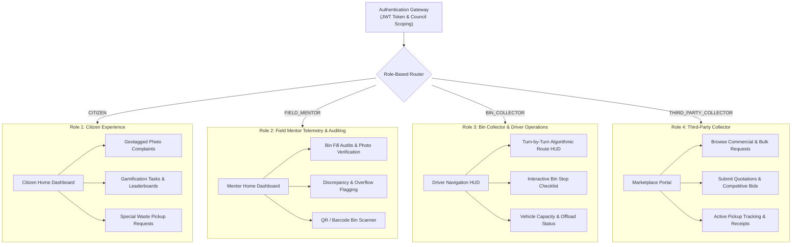
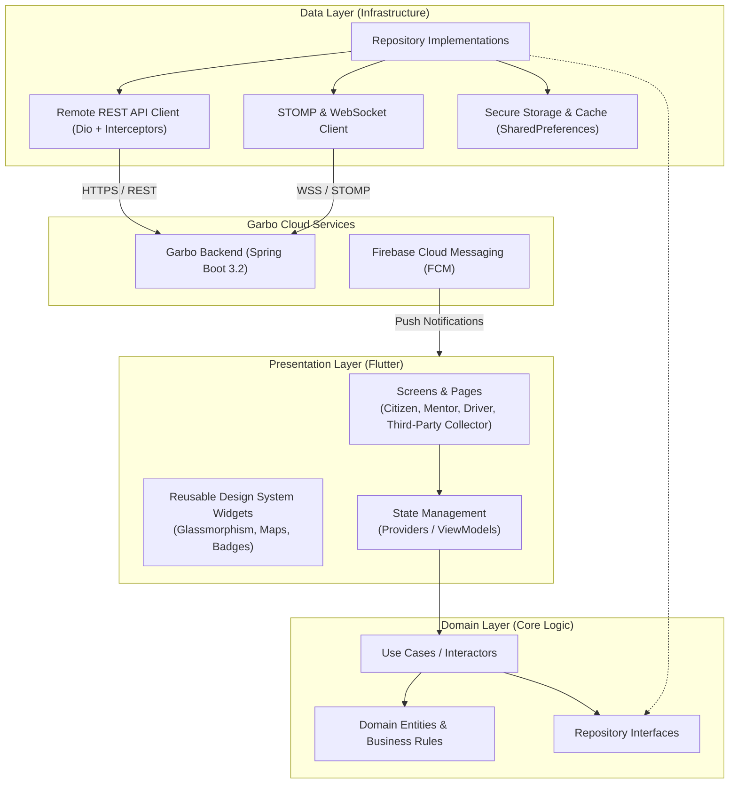
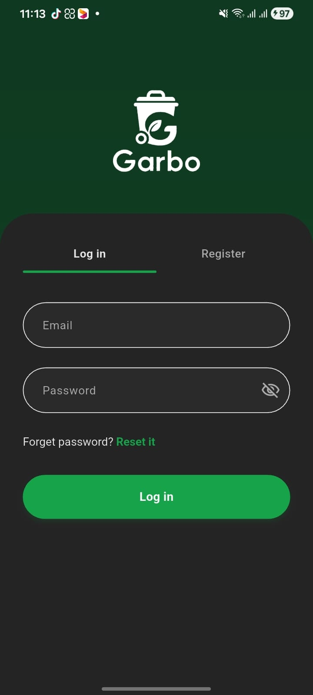
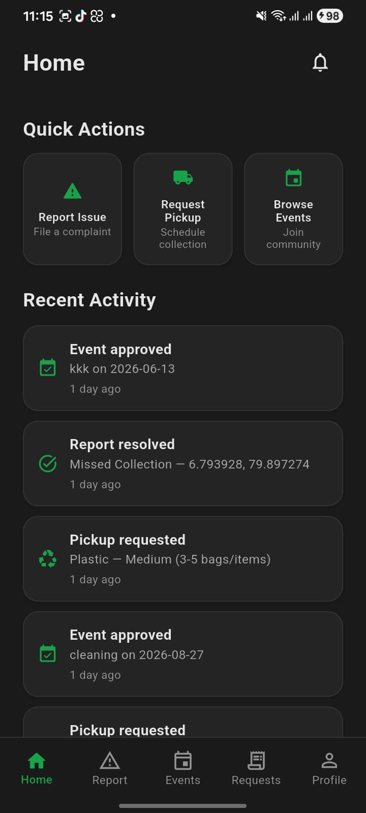
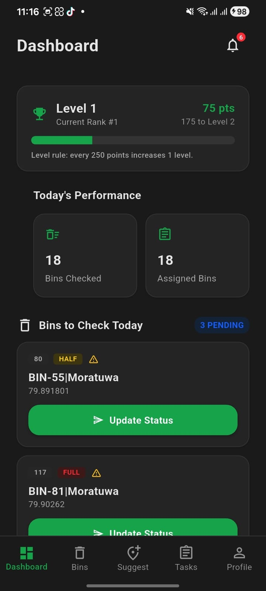
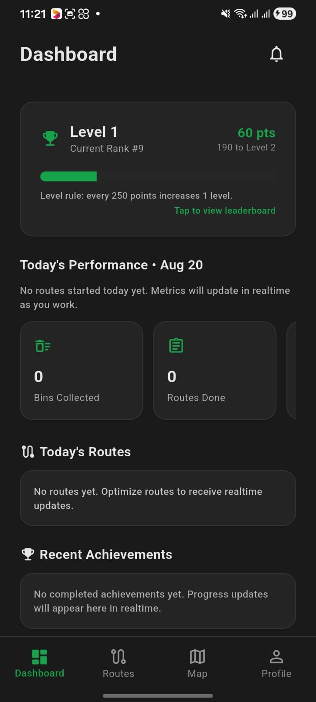
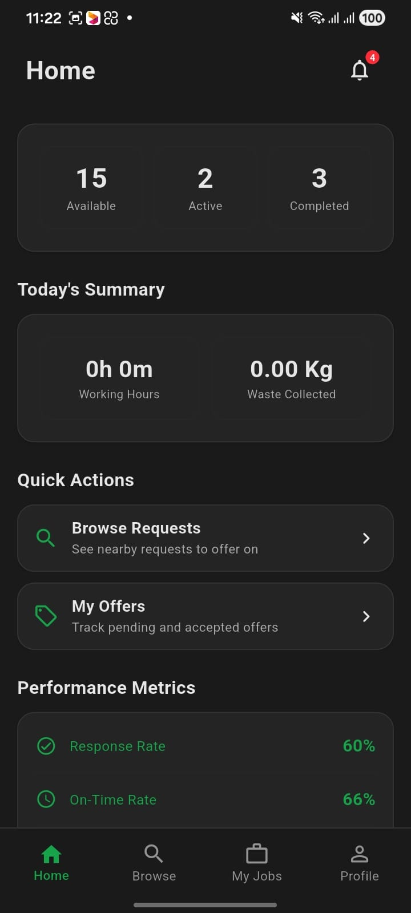

# Garbo Mobile Application (`Garbo-flutter`)

[](https://flutter.dev/)
[](https://developer.android.com/)
[](https://m3.material.io/)
[](https://developers.google.com/maps)
[](https://firebase.google.com/docs/cloud-messaging)

> **Garbo Mobile** is an intuitive, multi-role cross-platform mobile application built with **Flutter**. It provides seamless, real-time field operations, citizen crowdsourcing, telemetry auditing, and driver navigation for the **Garbo Smart Waste Management Ecosystem**.

---

## Table of Contents
- [1. Mobile Application Overview](#1-mobile-application-overview)
- [2. Multi-Role User Architecture & Purpose](#2-multi-role-user-architecture--purpose)
- [3. Application Architecture & Data Flow](#3-application-architecture--data-flow)
- [4. User Interface Showcase](#4-user-interface-showcase)
- [5. Technology Stack](#5-technology-stack)
- [6. Project Structure](#6-project-structure)
- [7. Getting Started & Setup](#7-getting-started--setup)
- [8. Build & CI/CD Pipelines](#8-build--cicd-pipelines)

---

## 1. Mobile Application Overview

Garbo Mobile unifies all field-facing stakeholders in municipal solid waste operations into a single, cohesive, high-performance application:

* **For Citizens**: Empowers residents to report overflowing bins with geotagged photos, track complaint lifecycles, earn gamification points, compete on council leaderboards, and schedule specialized bulk pickups.
* **For Field Mentors**: Provides IoT and manual bin fill-level telemetry auditing, QR code bin identification, discrepancy flagging, and on-ground verification.
* **For Bin Collectors & Drivers**: Delivers turn-by-turn dynamic collection route navigation powered by Google OR-Tools optimization, real-time stop completion checklists, and capacity monitoring.
* **For Third-Party Collectors**: Offers a specialized marketplace to discover commercial, bulky, and hazardous waste requests, submit competitive quotations, and manage fulfillment workflows.

---

## 2. Multi-Role User Architecture & Purpose

Upon authentication, the app dynamically adapts its entire user interface, navigation tree, and real-time listeners based on the authenticated user's assigned role:



### Detailed Purpose & Responsibilities of Each Role

#### 1. Citizen (Civic Engagement & Action)
* **Incident & Overflow Reporting**: Capture photos of overflowing public bins, damaged containers, or illegal dumpsites with automatic GPS geotagging.
* **Bin Placement Suggestions**: Propose new public bin locations and vote on community bin placement initiatives.
* **Gamification & Leaderboard**: Earn eco-points for verified green reporting actions, complete sustainability challenges, and track ranking on the municipal council leaderboard.
* **Specialized Collection Requests**: Request on-demand pickups for e-waste, large bulky items, recyclable cardboard, or hazardous household waste.

#### 2. Field Mentor (Ground Telemetry & Auditing)
* **Physical Bin Audits**: Perform routine ground inspections of municipal bins across designated urban zones.
* **Telemetry Verification**: Report accurate fill percentages (0-100%), bin physical damage, lid issues, and overflow conditions.
* **QR / Barcode Identification**: Instantly scan bin QR/RFID tags to retrieve bin metadata, history, and assigned council.
* **Discrepancy Reporting**: Log and flag discrepancies between predicted IoT sensor readings and ground truth conditions to improve routing accuracy.

#### 3. Bin Collector & Driver (Fleet Navigation & Stop Execution)
* **Turn-by-Turn Navigation HUD**: Access optimal collection routes algorithmically generated by Google OR-Tools and OSRM based on live bin fill priorities.
* **Stop Completion Checklist**: Mark bin collections in real-time, record skip reasons when bins are blocked/inaccessible, and log collection timestamps.
* **Capacity Monitoring**: Track onboard truck volume and weight limits, receiving automated directions to the nearest municipal disposal facility when capacity is reached.

#### 4. Third-Party Collector (Specialized Waste Marketplace)
* **Licensed Private Operators**: Enables accredited private waste collectors and specialized recyclers to operate within the municipal ecosystem.
* **Marketplace Request Discovery**: Browse specialized waste pickup requests posted by citizens and commercial entities (e-waste, scrap metal, construction debris).
* **Quotation & Bidding Engine**: Submit competitive pricing, estimated pickup windows, and terms directly to request owners.
* **Fulfillment & Receipts**: Navigate to pickup locations, execute collections, upload completion evidence, and generate digital service receipts.

---

## 3. Application Architecture & Data Flow

Garbo Mobile adheres to **Clean Architecture** principles, decoupling presentation, business domain logic, and data sources:



---

## 4. User Interface Showcase

The application automatically routes users upon authentication to their designated role-specific main home interface:

| Authentication Gateway | Role 1: Citizen Home | Role 2: Field Mentor Home |
|:---:|:---:|:---:|
|  |  |  |
| *Role-aware JWT sign-in* | *Citizen map, complaints & task feed* | *Bin telemetry auditing & status report* |

| Role 3: Bin Collector & Driver Home | Role 4: Third-Party Collector Home |
|:---:|:---:|
|  |  |
| *Turn-by-turn algorithmic route navigation* | *Specialized waste request feed & bids* |

---

## 5. Technology Stack

| Component | Library / Framework | Description |
|---|---|---|
| **Framework** | Flutter `3.x` / Dart `3.x` | Cross-platform compiled mobile engine |
| **UI Design System** | Material 3 & Glassmorphic UI | Modern responsive mobile components & animations |
| **State Management** | Provider / Riverpod / ChangeNotifier | Scalable reactive state management |
| **HTTP & Networking** | Dio | HTTP client with JWT interceptors & token refresh |
| **Real-Time Communication** | `stomp_dart_client` / `web_socket_channel` | Bi-directional STOMP pub/sub messaging |
| **Mapping & Geolocation** | `google_maps_flutter` / `geolocator` | Real-time GPS tracking and interactive GIS maps |
| **Push Notifications** | `firebase_messaging` / `flutter_local_notifications` | Background and foreground alert dispatch |
| **Secure Storage** | `flutter_secure_storage` | Encrypted keychain/keystore token storage |
| **Media & Camera** | `image_picker` / `camera` | High-resolution photo capture and compression |

---

## 6. Project Structure

```text
Garbo-flutter/
├── android/                    # Native Android project configuration & Gradle scripts
├── ios/                        # Native iOS Xcode workspace & Pods
├── assets/                     # Icons, static images, and branding assets
├── docs/
│   └── screenshots/            # Showcase screenshots for documentation
├── lib/
│   ├── main.dart               # Application entrypoint & dependency bootstrap
│   ├── core/                   # Shared cross-cutting modules
│   │   ├── constants/          # API endpoints, colors, and layout constants
│   │   ├── errors/             # Custom exception classes and failure models
│   │   ├── map/                # Map marker utilities and polyline decoders
│   │   ├── router/             # App routing and role-based guards
│   │   ├── services/           # Token storage, location, and FCM services
│   │   └── theme/              # Light & dark theme definitions
│   ├── data/                   # Data layer
│   │   ├── models/             # Serialization DTOs and JSON converters
│   │   ├── repositories/       # Repository implementations
│   │   └── sources/            # Remote HTTP and WebSocket data sources
│   ├── domain/                 # Domain layer
│   │   ├── entities/           # Pure Dart business models
│   │   ├── repositories/       # Abstract repository contracts
│   │   └── usecases/           # Specific business operation use cases
│   └── presentation/           # UI & presentation layer
│       ├── auth/               # Login, registration, and password recovery
│       ├── citizen/            # Citizen screens, complaints, and leaderboard
│       ├── field_staff/        # Field mentor bin auditing and QR screens
│       ├── collection_team/    # Collector navigation and stop checklist
│       ├── third_party_collector/ # Third-party collector marketplace and bidding
│       ├── providers/          # State management providers
│       └── widgets/            # Reusable buttons, cards, dialogs, and inputs
├── test/                       # Unit and widget test suite
├── pubspec.yaml                # Flutter package dependencies
└── README.md                   # Project documentation
```

---

## 7. Getting Started & Setup

### Prerequisites
* **Flutter SDK**: `3.22+` (Dart `3.4+`)
* **Android Studio** (with Android SDK 34+) or **Xcode** (for iOS macOS builds)
* Running instance of [Garbo Backend](https://github.com/CodeMIndsUoM/Garbo_backend)

### 1. Clone & Fetch Dependencies
```bash
git clone https://github.com/CodeMIndsUoM/Garbo-flutter.git
cd Garbo-flutter
flutter pub get
```

### 2. Configure Backend API Endpoint
Pass the API base URL via `--dart-define` at runtime:
```bash
# Local development against local backend
flutter run --dart-define=API_BASE=http://10.0.2.2:8081

# Connect to cloud production backend
flutter run --dart-define=API_BASE=https://api.garbo.codeminds.lk
```

---

## 8. Build & CI/CD Pipelines

### Generate Release APK
```bash
flutter build apk --release --dart-define=API_BASE=https://api.garbo.codeminds.lk
```
The compiled output is placed in `build/app/outputs/flutter-apk/app-release.apk`.

### Automated GitHub Actions Workflow
* **Code Analysis & Linting**: Automatically validates static analysis on all pull requests.
* **Continuous APK Build**: On push to `main` and `devops/platform`, GitHub Actions builds and archives production release artifacts.

---

## Contributors & Maintainers
Developed by the **CodeMinds UoM** Engineering Team.
